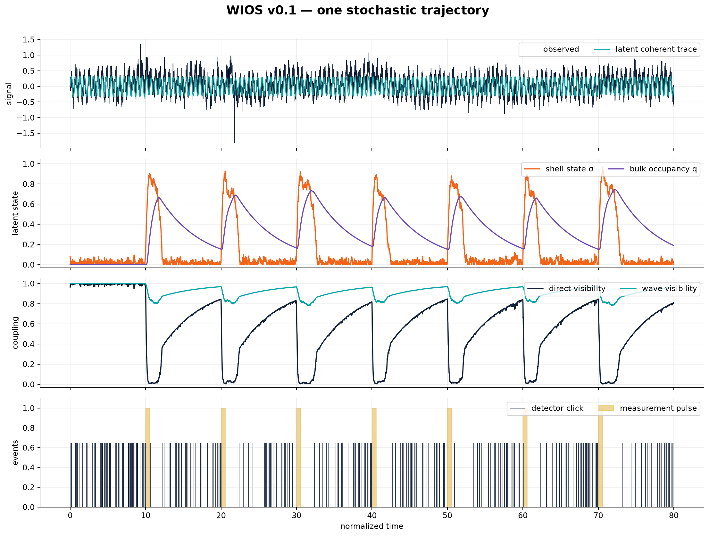
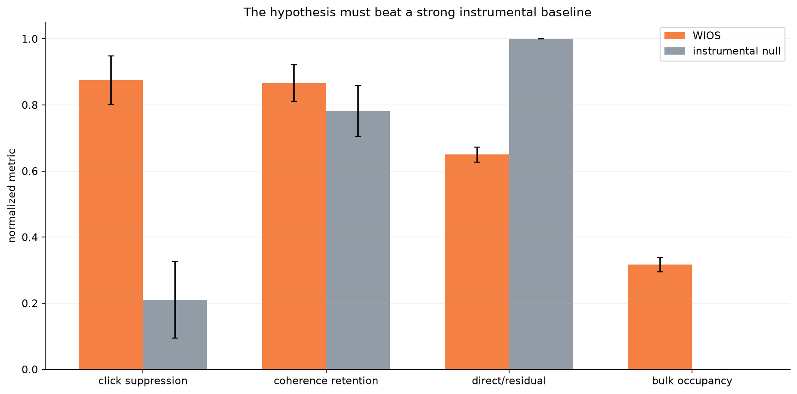
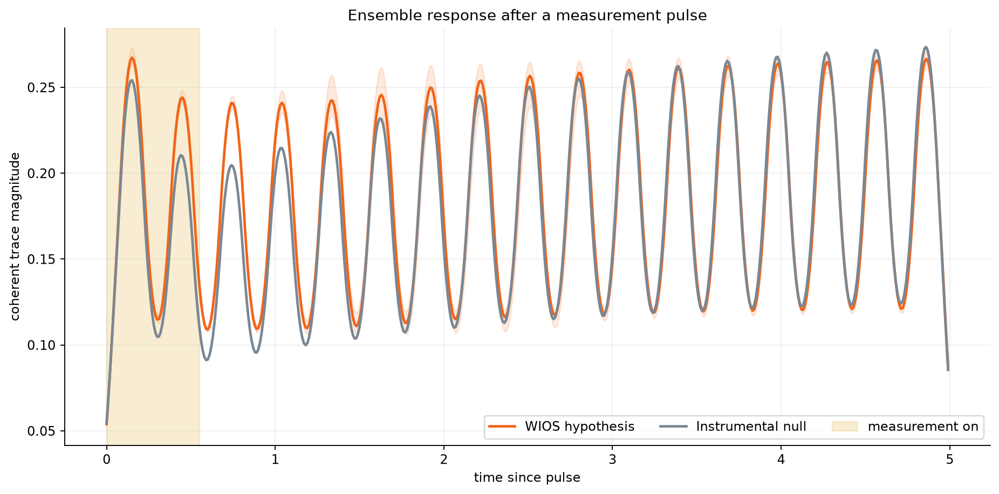

# Absurd Theory

**A deliberately speculative idea, implemented so it can fail.**

Absurd Theory is the first executable version of the **Wave-Induced
Observability Shell (WIOS)** hypothesis. The central postulate is intentionally
unconventional:

> A weak particle-like excitation may generate, through its own wave state, a
> temporary observability shell. Measurement noise and backaction can strengthen
> that shell, strongly suppressing direct detection while a weaker coherent wave
> trace remains observable.

This repository does **not** claim that WIOS exists in nature, that an extra
dimension has been detected, or that unexplained detector noise contains hidden
particles. It creates a quantitative toy world in which the idea can be
simulated, compared with ordinary instrumental effects, and eventually rejected
or refined.



## The idea in one minute

The model contains four quantities:

- `Φ`: a weak coherent excitation (the particle/wave state);
- `σ`: a wave-induced observability shell;
- `q`: a latent bulk-occupancy variable;
- `M(t)`: controlled measurement pulses.

The proposed causal loop is:

```text
weak wave Φ → shell σ → direct channel is hidden
                  ↑
        measurement + noise

shell σ → possible bulk occupancy q → delayed recovery
```

WIOS predicts a regime in which

```text
direct detector clicks fall sharply
while a phase-coherent residual trace survives.
```

That joint signature matters. A detector artifact can also create silence and
recovery, so this project includes a strong instrumental null model with
measurement saturation, colored noise, glitches, and finite recovery time.

## What v0.1 simulates

The shell follows a bounded stochastic differential equation:

```math
d\sigma = \left[-2\kappa\sigma(1-\sigma)(1-2\sigma)
+ a_\Phi |\Phi|^2(1-\sigma)
+ a_M M(t)(1-\sigma)
- \gamma\sigma\right]dt
+ \eta\,dW_t.
```

The first term provides a nonlinear barrier, the wave weakly drives its own
shell, measurement supplies backaction, `γ` allows recovery, and `dW` represents
stochastic perturbations.

The latent bulk occupancy is deliberately phenomenological:

```math
\dot q = k_{in}\,S(\sigma-\sigma_c)(1-q)-k_{out}q,
```

where `S` is a smooth threshold. It does not yet solve a five-dimensional field
equation; it is a testable placeholder for the conjectured transition.

The two observation channels respond differently:

```math
g_{direct}=e^{-\alpha\sigma^2}(1-q),
```

```math
g_{wave}=\frac{1-\beta_q q}{1+\beta_\sigma\sigma^2}.
```

This asymmetry is the core of the hypothesis. If every channel is suppressed in
the same way, ordinary detector saturation is a simpler explanation.

The complete scientific specification is in
[`docs/theory_v0.1.md`](docs/theory_v0.1.md).

## Quick start

Requires Python 3.10 or newer.

```bash
git clone https://github.com/belemcrizan/absurd_theory.git
cd absurd_theory

python -m venv .venv
source .venv/bin/activate          # Windows: .venv\Scripts\activate
python -m pip install -e ".[dev]"

pytest
absurd-theory --output results/my_run --runs 32 --seed 42
```

The command writes:

- `wios_trace.csv`: every simulated state and observable;
- `summary.json`: configuration, metrics, means, and standard deviations;
- `wios_dashboard.png`: a representative time trajectory;
- `pulse_response.png`: ensemble response after measurement;
- `model_comparison.png`: WIOS versus the instrumental null.

All default parameters live in [`configs/default.json`](configs/default.json).
They use **normalized units** and are not fitted to evidence for a new particle.

## What happened in the reference run?

The committed demonstration uses seed 42 and 32 trajectories per model.

| Ensemble metric | WIOS | Instrumental null |
|---|---:|---:|
| Direct-click suppression after measurement | 0.875 ± 0.075 | 0.211 ± 0.118 |
| Coherent-wave retention after measurement | 0.867 ± 0.057 | 0.782 ± 0.079 |
| Mean direct/residual visibility ratio | 0.650 ± 0.023 | 1.000 ± 0.000 |
| Mean latent bulk occupancy | 0.317 ± 0.021 | 0.000 |



Within this toy world, measurement suppresses the direct channel much more than
the residual coherent channel. That means the equations successfully encode the
proposed behavior. It does **not** mean the behavior has been observed in real
data.

The pulse response also shows why a baseline is indispensable: an instrument
with saturation and recovery can imitate part of the shape.



## Use empirical background noise

The default noise is a combination of white noise, an AR(1) colored component,
sparse non-Gaussian glitches, and stochastic shell perturbations. A real numeric
CSV trace can be resampled as an additional adversarial background:

```bash
absurd-theory \
  --noise-csv path/to/noise.csv \
  --noise-column strain \
  --output results/empirical_noise \
  --runs 64
```

Recommended public sources are documented in [`data/README.md`](data/README.md):

- [GWOSC](https://gwosc.org/tutorials/) for calibrated gravitational-wave
  detector strain and data-quality tutorials;
- [Gravity Spy](https://zenodo.org/records/5649212) for classified LIGO glitch
  metadata;
- [ATLAS Open Data](https://atlas.cern/Resources/Opendata) for a future
  missing-momentum validation track;
- [XENON public data](https://xenonexperiment.org/public-data/) for future
  rare-event background studies.

These sources help us construct harder null hypotheses. They are not treated as
positive evidence for WIOS.

## Falsification gates

WIOS v0.1 should be rejected or substantially revised if any of these occurs:

1. **No stable region:** the equations cannot maintain a bounded shell without
   fine-tuned clipping or unphysical energy injection.
2. **No channel asymmetry:** direct and residual visibility are suppressed
   identically.
3. **Instrumental equivalence:** a calibrated detector-only model reproduces all
   WIOS observables with equal or lower complexity.
4. **No out-of-sample prediction:** parameters inferred from one pulse schedule
   fail on a preregistered schedule, frequency, or noise regime.
5. **Conservation failure:** a future field-theoretic implementation cannot
   conserve probability, energy, charge, or causal propagation in the complete
   geometry.
6. **No identifiability:** different shell/bulk states always produce the same
   accessible distributions.

Passing these gates would still not prove the theory; it would justify building
a less phenomenological version.

## Scientific lineage

The pieces surrounding WIOS have established precedents, even though their
combination here is speculative:

- Arkani-Hamed, Dimopoulos and Dvali discuss localized fields, missing energy,
  and particles returning from compact extra dimensions in
  [hep-ph/9803315](https://arxiv.org/abs/hep-ph/9803315).
- Dvali, Gabadadze and Shifman study quasi-localized fields and leakage into
  extra dimensions in
  [hep-th/0010071](https://arxiv.org/abs/hep-th/0010071).
- K-field theories provide compact defects and suppressed propagation outside a
  localized region in
  [arXiv:0711.3550](https://arxiv.org/abs/0711.3550).
- Feshbach projection gives a standard language for dividing observable and
  hidden sectors of an open quantum system; see
  [arXiv:0711.2926](https://arxiv.org/abs/0711.2926).
- Boundary inverse problems ask when inaccessible internal structure can be
  reconstructed from boundary measurements; see
  [Uhlmann's overview](https://www.numdam.org/item/SLSEDP_2012-2013____A13_0/).

None of these references establishes the WIOS postulate. They supply constraints,
mathematical tools, and alternative explanations.

## Roadmap

- **v0.1 — current:** stochastic shell, phenomenological bulk state, strong
  instrumental baseline, empirical-noise adapter, reproducible plots.
- **v0.2:** parameter recovery, likelihood-based model comparison, ablations,
  calibration curves, and preregistered pulse schedules.
- **v0.3:** replace `q` with a discretized extra-dimensional wave equation and
  measure probability flow between brane and bulk.
- **v0.4:** formulate an action, derive equations of motion, test stability and
  conservation, and remove any ad hoc clipping.
- **v1.0:** confront a frozen model with held-out public detector data without
  retrofitting anomalies.

## Responsible interpretation

This repository is a disciplined exploration of an absurd hypothesis. Simulated
success means only that the specified equations can generate the specified
behavior. An anomaly in public data would first be treated as instrumentation,
environment, selection bias, or modeling error. A physical claim would require
independent detectors, preregistered predictions, calibrated backgrounds,
replication, and a consistent field theory.

That boundary is not a weakness of the project. It is what makes the absurd idea
scientifically discussable.
